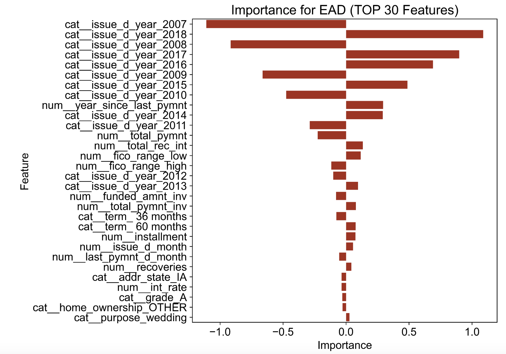

# Exposure at Default (EAD) Modeling

## Project Overview
This project investigates **Exposure at Default (EAD)** modeling using defaulted loan data from Lending Club. The objective is to predict potential exposure a lender might face during a borrower's default event, leveraging Ridge Regression and exploring critical factors affecting EAD. The analysis spans loans issued between 2007 and 2018.

## Key Findings
1. **Significant Features**:
   - Loan issuance year and time since the last payment are crucial predictors.
   - Loans issued during the 2007–2010 financial crisis exhibited lower exposures due to stricter credit policies.
   - Loans issued between 2015–2018 showed higher exposures, peaking in 2018, attributed to deregulation and quantitative easing.
   - Large fluctuations in FICO Scores increase exposure risk.
2. **Model Performance**:
   - Ridge Regression with hyperparameter tuning achieved a Mean Absolute Error (MAE) of 0.0446 on the test set.

